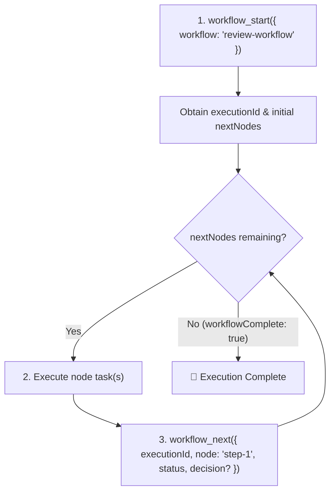

# Workflow MCP Server - Instructions & Best Practices

The **workflow-mcp** server provides tools to design, validate, execute, step through, and visualize
structured workflows, Directed Acyclic Graphs (DAGs), review-fix loops, and subworkflows.

---

## 1. Core Concepts: Templates vs. Executions

- **Workflow Definition (Template / DAG)**:
  - Created and modified using `workflow_create`, `node_add`, `node_connect`, `node_edit`,
    `node_delete`, `workflow_patch`, `workflow_validate`, `workflow_visualize`.
  - Defines the graph topology: nodes (`start`, `step`, `decision`, `user_interaction`,
    `subworkflow`, `end`) and edges.
- **Workflow Execution (Run Instance)**:
  - Created by invoking `workflow_start({ workflow: "review-workflow" })`.
  - Generates an isolated **`executionId`** (`crypto.randomUUID()`).
  - All runtime step updates, iteration tracking, and branching decisions are scoped to this
    `executionId`. Multiple concurrent runs of the same workflow never collide.

---

## 2. Name, Slug, & Hierarchical Path Resolution

All tools support flexible entity identifiers so you never have to manually lookup UUIDs:

- **UUID**: `7d1cd599-d9fd-44ee-88c1-9389db3eb076`
- **Workflow Name or Slug**: `"Review Workflow"`, `"review-workflow"`, `"security-check"`
- **Hierarchical Subworkflow Paths**: `"review-workflow/security"` resolves the `security` child
  workflow under `review-workflow`
- **Node Names & Slugs**: `"Step 5-web"`, `"step-5-web"`, `"Risk Gate"`
- **Parameter Aliases**: Tools accept either `workflow` / `workflowId`, `node` / `nodeId`,
  `fromNode` / `fromNodeId`, `toNode` / `toNodeId`, `nodes` / `nodeIds`.

---

## 3. Standard Execution Lifecycle

Follow this standard loop when executing a workflow:



### Step 1: Start Execution (`workflow_start`)

- **Call**: `workflow_start({ workflow: "review-workflow" })`
- **What it returns**:
  - `executionId`: The unique ID identifying this run (required for subsequent `workflow_next`
    calls).
  - `nextNodes`: Array of actionable node(s) immediately following the start node.
  - `workflowSummary`: Current node progress counts.
  - `mermaidDiagram`: Mermaid flowchart of current execution state.

### Step 2: Step Through Nodes (`workflow_next`)

- **Call**:
  `workflow_next({ executionId: "<execution_id>", node: "Step 1", status: "completed" | "failed" | "skipped", decision?: "<branch_name>" })`
- **Required parameters**:
  - `executionId`: The active run ID from `workflow_start`.
  - `node` / `nodeId`: The name, slug, or ID of the node being completed/reported.
  - `status`: Outcome (`"completed"`, `"failed"`, or `"skipped"`).
- **Conditional / Branching parameters**:
  - `decision`: **Required** when `node` is a `decision` or `user_interaction` node with branching
    conditions. Pass the chosen branch label matching an outbound edge condition (e.g.,
    `"approved"`, `"needs_fixes"`, `"yes"`, `"no"`).
  - `error`: Optional error string if `status === "failed"`.

### Step 3: Inspecting Hierarchy (`workflow_tree`)

- **Call**: `workflow_tree({ workflow: "review-workflow", depth: 3 })`
- Instantly returns a recursive hierarchical tree diagram of parent workflows and all nested child
  subworkflows.

### Step 4: Cross-Workflow Search (`workflow_search`)

- **Call**: `workflow_search({ query: "authentication OR passkey", includeDescriptions: true })`
- Instantly searches across standalone workflows and child subworkflows with line context snippets.

### Step 5: Batch Node Updates (`workflow_patch`)

- **Call**:
  ```typescript
  workflow_patch({
    workflow: "review-workflow/security",
    nodes: [
      { node: "Step 5-web", description: "Updated web security scan prompt" },
      { node: "Risk Gate", config: { options: ["allow", "block"] } },
    ],
  });
  ```
- Applies multi-node edits atomically in a single roundtrip.

---

## 4. Tool Quick Reference

| Category                       | Tool Name                      | Description                                           | Key Arguments                                                        |
| :----------------------------- | :----------------------------- | :---------------------------------------------------- | :------------------------------------------------------------------- |
| **Execution**                  | `workflow_start`               | Begin an execution run instance.                      | `workflow`, `format?`                                                |
| **Execution**                  | `workflow_next`                | Advance execution after completing a node.            | `executionId`, `node`, `status`, `decision?`, `error?`               |
| **Execution**                  | `workflow_reset`               | Reset an execution run back to start.                 | `executionId`, `workflow?`                                           |
| **Authoring**                  | `workflow_create`              | Create a new workflow template.                       | `name`, `description?`, `intendedForIndependentRun?`                 |
| **Authoring**                  | `workflow_list`                | List existing workflows.                              | `filter?`, `format?`                                                 |
| **Authoring**                  | `workflow_get`                 | Inspect workflow graph (nodes & edges).               | `workflow`, `includeSubworkflows?`, `format?`                        |
| **Authoring**                  | `workflow_search`              | Cross-workflow search across names, prompts & configs | `query`, `workflow?`, `type?`, `includeDescriptions?`                |
| **Authoring**                  | `workflow_patch`               | Batch edit multiple nodes in one atomic transaction.  | `workflow`, `nodes: [{ node, name?, description?, config? }]`        |
| **Authoring**                  | `workflow_tree`                | Recursive hierarchical view of nested subworkflows.   | `workflow`, `depth?`, `format?`                                      |
| **Authoring**                  | `workflow_delete`              | Delete a workflow and all its nodes/edges.            | `workflow`                                                           |
| **Nodes**                      | `node_add`                     | Add a node to a workflow.                             | `workflow`, `name`, `type`, `description?`, `config?`                |
| **Nodes**                      | `node_edit`                    | Modify an existing node.                              | `workflow`, `node`, `name?`, `description?`, `config?`               |
| **Nodes**                      | `node_delete`                  | Delete a node and connected edges.                    | `workflow`, `node`                                                   |
| **Nodes**                      | `node_list`                    | List all nodes in a workflow.                         | `workflow`                                                           |
| **Edges**                      | `node_connect`                 | Connect two nodes with optional condition.            | `workflow`, `fromNode`, `toNode`, `condition?`                       |
| **Edges**                      | `node_disconnect`              | Remove edge between two nodes.                        | `workflow`, `fromNode`, `toNode`                                     |
| **Validation & Viz**           | `workflow_validate`            | Validate DAG, start/end nodes, cycles, heuristics.    | `workflow`                                                           |
| **Validation & Viz**           | `workflow_visualize`           | Generate SSR visualizer link, Mermaid chart, or HTML. | `workflow`, `executionId?`, `format?`, `expiresInDays?`, `filePath?` |
| **Subworkflows & Portability** | `workflow_extract_subworkflow` | Extract node sequence into a child subworkflow.       | `workflow`, `nodes`, `subworkflowName`                               |
| **Subworkflows & Portability** | `workflow_export`              | Export workflow bundle JSON.                          | `workflow`, `includeSubworkflows?`, `filePath?`                      |
| **Subworkflows & Portability** | `workflow_import`              | Import workflow bundle JSON.                          | `bundleData?`, `filePath?`, `overwrite?`, `clone?`                   |
