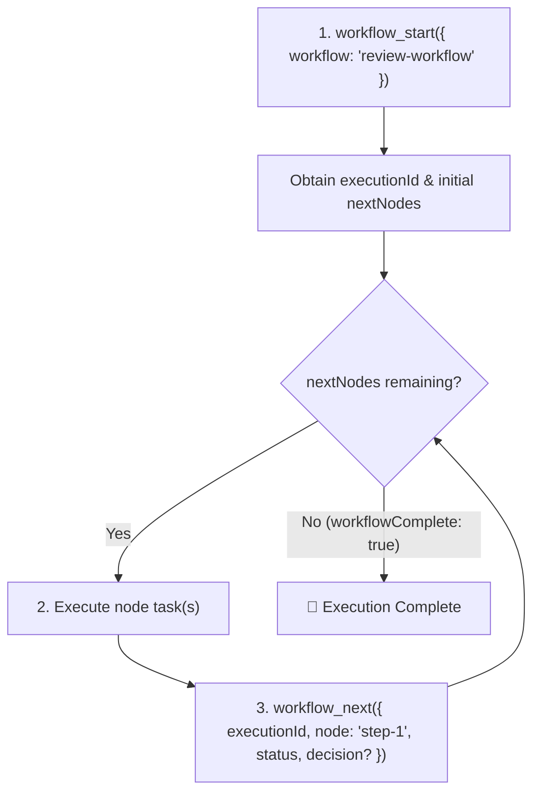
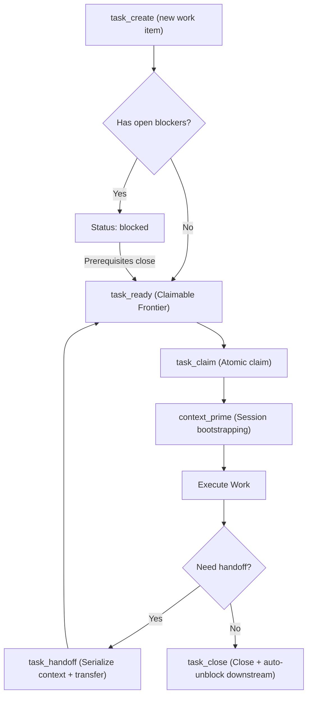

# Workflow MCP Server - Instructions & Best Practices

The **workflow-mcp** server provides tools to design, validate, execute, step through, and visualize
structured workflows, Directed Acyclic Graphs (DAGs), review-fix loops, and subworkflows.

---

## 1. Core Concepts: Templates vs. Executions

- **Workflow Definition (Template / DAG)**:
  - Created and modified using `workflow_create`, `node_add`, `node_connect`, `node_edit`,
    `node_delete`, `workflow_patch`, `workflow_validate`, `workflow_visualize`.
  - Defines the graph topology: nodes (`start`, `step`, `decision`, `user_interaction`,
    `subworkflow`, `end`) and edges.
- **Workflow Execution (Run Instance)**:
  - Created by invoking `workflow_start({ workflow: "review-workflow" })`.
  - Generates an isolated **`executionId`** (`crypto.randomUUID()`).
  - All runtime step updates, iteration tracking, and branching decisions are scoped to this
    `executionId`. Multiple concurrent runs of the same workflow never collide.

---

## 2. Name, Slug, & Hierarchical Path Resolution

All tools support flexible entity identifiers so you never have to manually lookup UUIDs:

- **UUID**: `7d1cd599-d9fd-44ee-88c1-9389db3eb076`
- **Workflow Name or Slug**: `"Review Workflow"`, `"review-workflow"`, `"security-check"`
- **Hierarchical Subworkflow Paths**: `"review-workflow/security"` resolves the `security` child
  workflow under `review-workflow`
- **Node Names & Slugs**: `"Step 5-web"`, `"step-5-web"`, `"Risk Gate"`
- **Parameter Aliases**: Tools accept either `workflow` / `workflowId`, `node` / `nodeId`,
  `fromNode` / `fromNodeId`, `toNode` / `toNodeId`, `nodes` / `nodeIds`.

---

## 3. Standard Execution Lifecycle

Follow this standard loop when executing a workflow:



### Step 1: Start Execution (`workflow_start`)

- **Call**: `workflow_start({ workflow: "review-workflow" })`
- **What it returns**:
  - `executionId`: The unique ID identifying this run (required for subsequent `workflow_next`
    calls).
  - `nextNodes`: Array of actionable node(s) immediately following the start node.
  - `workflowSummary`: Current node progress counts.

### Step 2: Step Through Nodes (`workflow_next`)

- **Call**:
  `workflow_next({ executionId: "<execution_id>", node: "Step 1", status: "completed" | "failed" | "skipped", decision?: "<branch_name>" })`
- **What it returns**:
  - Lean JSON payload containing only the next actionable step(s), completed node status, and
    workflow completion status (zero diagram or state dump bloat).
- **Required parameters**:
  - `executionId`: The active run ID from `workflow_start`.
  - `node` / `nodeId`: The name, slug, or ID of the node being completed/reported.
  - `status`: Outcome (`"completed"`, `"failed"`, or `"skipped"`).
- **Conditional / Branching parameters**:
  - `decision`: **Required** when `node` is a `decision` or `user_interaction` node with branching
    conditions. Pass the chosen branch label matching an outbound edge condition (e.g.,
    `"approved"`, `"needs_fixes"`, `"yes"`, `"no"`).
  - `error`: Optional error string if `status === "failed"`.

### Step 3: Inspecting Hierarchy (`workflow_tree`)

- **Call**: `workflow_tree({ workflow: "review-workflow", depth: 3 })`
- Instantly returns a recursive hierarchical tree diagram of parent workflows and all nested child
  subworkflows.

### Step 4: Cross-Workflow Search (`workflow_search`)

- **Call**: `workflow_search({ query: "authentication OR passkey", includeDescriptions: true })`
- Instantly searches across standalone workflows and child subworkflows with line context snippets.

### Step 5: Batch Node Updates (`workflow_patch`)

- **Call**:
  ```typescript
  workflow_patch({
    workflow: "review-workflow/security",
    nodes: [
      { node: "Step 5-web", description: "Updated web security scan prompt" },
      { node: "Risk Gate", config: { options: ["allow", "block"] } },
    ],
  });
  ```
- Applies multi-node edits atomically in a single roundtrip.

---

---

## 4. Work Tracking & Task Lifecycle (Beads Primitives)

`workflow-mcp` includes native task tracking and work scheduling inspired by the Beads framework:



- **Task Creation**:
  `task_create({ title: "Fix edge case", workflowId, executionId, nodeId, role: "security" })`
- **Ready Frontier**: `task_ready({ role: "security" })` returns only tasks with zero open blockers.
- **Atomic Claiming**: `task_claim({ task: "tk-a1b2c3", assignee: "agent-1" })` locks the task.
- **Dependencies**:
  `task_depend({ action: "add", fromTask: "tk-prereq", toTask: "tk-dependent", type: "blocks" })`
- **Closing & Cascading**: `task_close({ task: "tk-a1b2c3", reason: "Verified tests" })`
  automatically unblocks downstream tasks.

---

## 5. Roles & Single-Entry Role Journals

- **User-Defined Roles**: Roles are arbitrary strings (`"frontend"`, `"security-reviewer"`,
  `"human"`). Created automatically or via `role_create`.
- **Role Journals**: A single-entry snapshot per role (`journal_write` / `journal_read`).
  - Before a role shuts down, the agent writes what it was doing and next steps via `journal_write`.
  - When reawoken, the agent reads `journal_read` (or runs `context_prime`) to resume with full
    state awareness.
  - Only the **last entry** is kept per user/role, ensuring clean, fresh wakeup context.

---

## 6. Scoped Memory & Access Logging

Memories persist institutional knowledge across runs, agent crashes, and sessions:

- **Scopes**:
  - `workflow`: Scoped to a workflow template (e.g. API standards, architectural constraints).
  - `node`: Scoped to a specific node (e.g. known edge cases, test inputs).
  - `role`: Scoped to a role (e.g. security checklist, design system rules). Follows the role
    everywhere.
- **Listing Summaries**: `memory_list` returns one-line summaries only—never leaking full content
  into context windows prematurely. Includes `lastAccessed` timestamp and `accessCount`.
- **Logged Recall**: `memory_recall` returns full content and logs a `MemoryAccessRecord` to track
  memory usage patterns and identify stale knowledge.
- **Cleanup**: `memory_delete` returns the memory's lifetime `accessCount` before deletion.

---

## 7. Work Handoffs & Context Priming

- **`task_handoff`**: Transfers a task to another agent or role queue. Appends working context,
  records `rejectedApproaches` so subsequent agents don't repeat failures, and updates task
  assignment.
- **`context_prime`**: The primary session bootstrapping command. Gathers:
  1. Role journal (last shutdown entry)
  2. Workflow memories
  3. Node memories
  4. Role memories
  5. Active task details & context
  6. Recent handoff history & rejected approaches
  7. Ready frontier tasks Compacts all information into a token budget (default 2,000 tokens) and
     logs memory access records.

---

## 8. Tool Quick Reference (40 Tools)

| Category                       | Tool Name                      | Description                                                       | Key Arguments                                                           |
| :----------------------------- | :----------------------------- | :---------------------------------------------------------------- | :---------------------------------------------------------------------- |
| **Execution**                  | `workflow_start`               | Begin an execution run instance.                                  | `workflow`, `format?`                                                   |
| **Execution**                  | `workflow_next`                | Advance execution after completing a node (returns linked tasks). | `executionId`, `node`, `status`, `decision?`, `error?`                  |
| **Execution**                  | `workflow_reset`               | Reset an execution run back to start.                             | `executionId`, `workflow?`                                              |
| **Authoring**                  | `workflow_create`              | Create a new workflow template.                                   | `name`, `description?`, `intendedForIndependentRun?`                    |
| **Authoring**                  | `workflow_list`                | List existing workflows.                                          | `filter?`, `format?`                                                    |
| **Authoring**                  | `workflow_get`                 | Inspect workflow graph (nodes & edges).                           | `workflow`, `includeSubworkflows?`, `format?`                           |
| **Authoring**                  | `workflow_search`              | Cross-workflow search across names, prompts & configs             | `query`, `workflow?`, `type?`, `includeDescriptions?`                   |
| **Authoring**                  | `workflow_patch`               | Batch edit multiple nodes in one atomic transaction.              | `workflow`, `nodes: [{ node, name?, description?, config? }]`           |
| **Authoring**                  | `workflow_tree`                | Recursive hierarchical view of nested subworkflows.               | `workflow`, `depth?`, `format?`                                         |
| **Authoring**                  | `workflow_delete`              | Delete a workflow and all its nodes/edges.                        | `workflow`                                                              |
| **Nodes**                      | `node_add`                     | Add a node to a workflow.                                         | `workflow`, `name`, `type`, `description?`, `config?`                   |
| **Nodes**                      | `node_edit`                    | Modify an existing node.                                          | `workflow`, `node`, `name?`, `description?`, `config?`                  |
| **Nodes**                      | `node_delete`                  | Delete a node and connected edges.                                | `workflow`, `node`                                                      |
| **Nodes**                      | `node_list`                    | List all nodes in a workflow.                                     | `workflow`                                                              |
| **Edges**                      | `node_connect`                 | Connect two nodes with optional condition.                        | `workflow`, `fromNode`, `toNode`, `condition?`                          |
| **Edges**                      | `node_disconnect`              | Remove edge between two nodes.                                    | `workflow`, `fromNode`, `toNode`                                        |
| **Validation & Viz**           | `workflow_validate`            | Validate DAG, start/end nodes, cycles, heuristics.                | `workflow`                                                              |
| **Validation & Viz**           | `workflow_visualize`           | Generate SSR visualizer link, Mermaid chart, or HTML.             | `workflow`, `executionId?`, `format?`, `expiresInDays?`, `filePath?`    |
| **Subworkflows & Portability** | `workflow_extract_subworkflow` | Extract node sequence into a child subworkflow.                   | `workflow`, `nodes`, `subworkflowName`                                  |
| **Subworkflows & Portability** | `workflow_export`              | Export workflow bundle JSON.                                      | `workflow`, `includeSubworkflows?`, `filePath?`                         |
| **Subworkflows & Portability** | `workflow_import`              | Import workflow bundle JSON.                                      | `bundleData?`, `filePath?`, `overwrite?`, `clone?`                      |
| **Tasks**                      | `task_create`                  | Create an assignable work unit (bead).                            | `title`, `description?`, `role?`, `workflow?`, `node?`, `parentTaskId?` |
| **Tasks**                      | `task_list`                    | List tasks with status filter and summary counts.                 | `workflow?`, `executionId?`, `status?`, `role?`, `assignee?`            |
| **Tasks**                      | `task_get`                     | Get task details, dependencies, and child subtasks.               | `task`, `includeDependencies?`, `includeChildren?`                      |
| **Tasks**                      | `task_update`                  | Modify task metadata and append to context notes.                 | `task`, `title?`, `description?`, `status?`, `priority?`, `context?`    |
| **Tasks**                      | `task_close`                   | Close task and automatically unblock downstream tasks.            | `task`, `reason?`                                                       |
| **Tasks**                      | `task_ready`                   | Compute claimable frontier (zero open blockers).                  | `workflow?`, `executionId?`, `role?`, `limit?`                          |
| **Tasks**                      | `task_claim`                   | Atomically lock a task to an assignee.                            | `task`, `assignee`                                                      |
| **Tasks**                      | `task_depend`                  | Add or remove dependency edges between tasks.                     | `action`, `fromTask`, `toTask`, `type?`                                 |
| **Roles**                      | `role_create`                  | Define a user-defined role.                                       | `name`, `description?`                                                  |
| **Roles**                      | `role_list`                    | List registered user-defined roles.                               | `format?`                                                               |
| **Journal**                    | `journal_write`                | Save single-entry role shutdown snapshot.                         | `role`, `entry`, `writtenBy?`                                           |
| **Journal**                    | `journal_read`                 | Read role's latest journal entry on wakeup.                       | `role`                                                                  |
| **Memory**                     | `memory_save`                  | Save persistent memory (workflow, node, or role scope).           | `key`, `summary`, `content`, `scope`, `workflow?`, `node?`, `role?`     |
| **Memory**                     | `memory_list`                  | List memory summaries with lastAccessed & accessCount.            | `workflow?`, `node?`, `role?`, `tags?`, `format?`                       |
| **Memory**                     | `memory_recall`                | Retrieve full content and log access record.                      | `key`, `scope?`, `workflow?`, `node?`, `role?`, `accessedBy?`           |
| **Memory**                     | `memory_delete`                | Delete memory and return lifetime accessCount.                    | `key`, `scope?`, `workflow?`, `node?`, `role?`                          |
| **Handoff**                    | `task_handoff`                 | Transfer work preserving context and rejected approaches.         | `task`, `reason`, `contextSummary?`, `rejectedApproaches?`, `toRole?`   |
| **Context**                    | `context_prime`                | Bootstrap agent session with journal, memories, and frontier.     | `workflow?`, `executionId?`, `taskId?`, `role?`, `tokenBudget?`         |
