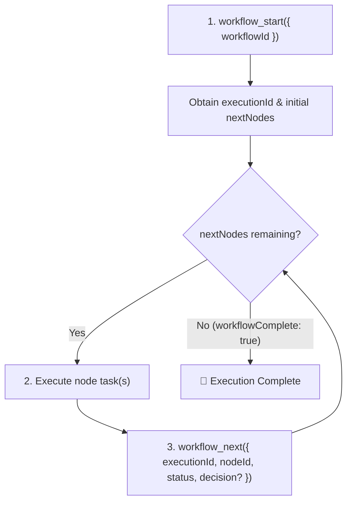

# Workflow MCP Server - Instructions & Best Practices

The **workflow-mcp** server provides tools to design, validate, execute, step through, and visualize
structured workflows, Directed Acyclic Graphs (DAGs), review-fix loops, and subworkflows.

---

## 1. Core Concepts: Templates vs. Executions

- **Workflow Definition (Template / DAG)**:
  - Created and modified using `workflow_create`, `node_add`, `node_connect`, `node_edit`,
    `node_delete`, `workflow_validate`, `workflow_visualize`.
  - Defines the graph topology: nodes (`start`, `step`, `decision`, `user_interaction`,
    `subworkflow`, `end`) and edges.
- **Workflow Execution (Run Instance)**:
  - Created by invoking `workflow_start({ workflowId })`.
  - Generates an isolated **`executionId`** (`crypto.randomUUID()`).
  - All runtime step updates, iteration tracking, and branching decisions are scoped to this
    `executionId`. Multiple concurrent runs of the same workflow never collide.

---

## 2. Standard Execution Lifecycle

Follow this standard loop when executing a workflow:

### Step 1: Start Execution (`workflow_start`)

- **Call**: `workflow_start({ workflowId: "<workflow_id>" })`
- **What it returns**:
  - `executionId`: The unique ID identifying this run (required for subsequent `workflow_next`
    calls).
  - `nextNodes`: Array of actionable node(s) immediately following the start node.
  - `workflowSummary`: Current node progress counts.
  - `mermaidDiagram`: Mermaid flowchart of current execution state.

### Step 2: Step Through Nodes (`workflow_next`)

- **Call**:
  `workflow_next({ executionId: "<execution_id>", nodeId: "<node_id>", status: "completed" | "failed" | "skipped", decision?: "<branch_name>" })`
- **Required parameters**:
  - `executionId`: The active run ID from `workflow_start`.
  - `nodeId`: The ID of the node being completed/reported.
  - `status`: Outcome (`"completed"`, `"failed"`, or `"skipped"`).
- **Conditional / Branching parameters**:
  - `decision`: **Required** when `nodeId` is a `decision` or `user_interaction` node with branching
    conditions. Pass the chosen branch label matching an outbound edge condition (e.g.,
    `"approved"`, `"needs_fixes"`, `"yes"`, `"no"`).
  - `error`: Optional error string if `status === "failed"`.
- **What it returns**:
  - `nextNodes`: The next set of actionable steps.
  - `workflowComplete`: `true` if all paths reached terminal `end` nodes or no further outbound
    steps remain.

### Step 3: Handling Subworkflows

- When an actionable node returned in `nextNodes` has `type: "subworkflow"`:
  1. Inspect `node.config.childWorkflowId`.
  2. Invoke the child workflow: `workflow_start({ workflowId: childWorkflowId })`.
  3. Execute the child workflow to completion using its child `executionId`.
  4. Advance the parent workflow:
     `workflow_next({ executionId: parentExecutionId, nodeId: subworkflowNodeId, status: "completed" })`.

### Step 4: Resetting an Execution (`workflow_reset`)

- Call `workflow_reset({ executionId: "<execution_id>" })` to reset all node states back to pending
  and restart at the start node.

---

## 3. Tool Quick Reference

| Category                       | Tool Name                      | Description                                          | Key Arguments                                            |
| :----------------------------- | :----------------------------- | :--------------------------------------------------- | :------------------------------------------------------- |
| **Execution**                  | `workflow_start`               | Begin an execution run instance.                     | `workflowId`, `format?`                                  |
| **Execution**                  | `workflow_next`                | Advance execution after completing a node.           | `executionId`, `nodeId`, `status`, `decision?`, `error?` |
| **Execution**                  | `workflow_reset`               | Reset an execution run back to start.                | `executionId`                                            |
| **Authoring**                  | `workflow_create`              | Create a new workflow template.                      | `name`, `description?`, `intendedForIndependentRun?`     |
| **Authoring**                  | `workflow_list`                | List existing workflows.                             | `filter?`, `format?`                                     |
| **Authoring**                  | `workflow_get`                 | Inspect workflow graph (nodes & edges).              | `workflowId`, `format?`                                  |
| **Authoring**                  | `workflow_delete`              | Delete a workflow and all its nodes/edges.           | `workflowId`                                             |
| **Nodes**                      | `node_add`                     | Add a node to a workflow.                            | `workflowId`, `name`, `type`, `description?`, `config?`  |
| **Nodes**                      | `node_edit`                    | Modify an existing node.                             | `nodeId`, `name?`, `description?`, `type?`, `config?`    |
| **Nodes**                      | `node_delete`                  | Delete a node and connected edges.                   | `nodeId`                                                 |
| **Nodes**                      | `node_list`                    | List all nodes in a workflow.                        | `workflowId`                                             |
| **Edges**                      | `node_connect`                 | Connect two nodes with optional condition.           | `fromNodeId`, `toNodeId`, `condition?`                   |
| **Edges**                      | `node_disconnect`              | Remove edge between two nodes.                       | `fromNodeId`, `toNodeId`                                 |
| **Validation & Viz**           | `workflow_validate`            | Validate DAG, start/end nodes, cycles, heuristics.   | `workflowId`                                             |
| **Validation & Viz**           | `workflow_visualize`           | Generate Mermaid diagram or export interactive HTML. | `workflowId`, `executionId?`, `exportHtml?`              |
| **Subworkflows & Portability** | `workflow_extract_subworkflow` | Extract node sequence into a child subworkflow.      | `workflowId`, `nodeIds`, `name`                          |
| **Subworkflows & Portability** | `workflow_export`              | Export workflow bundle JSON.                         | `workflowId`, `includeSubworkflows?`, `filePath?`        |
| **Subworkflows & Portability** | `workflow_import`              | Import workflow bundle JSON.                         | `bundleData?`, `filePath?`, `overwrite?`, `clone?`       |

---

## 4. Common Validation & Error Scenarios

1. **Missing `executionId` on `workflow_next`**:
   - Calling `workflow_next` without `executionId` triggers an immediate argument validation error:
     `Invalid arguments: executionId: Required`
2. **Missing `nodeId` on `workflow_next`**:
   - Triggers an immediate argument validation error: `Invalid arguments: nodeId: Required`
3. **Invalid `executionId`**:
   - Returns: `Execution with ID "<id>" not found. Start a workflow first using workflow_start.`
4. **Missing `decision` on Branching Nodes**:
   - If `nodeId` is a `decision` or `user_interaction` node with condition-based edges and
     `decision` is omitted, `workflow_next` returns a descriptive error listing the available
     options:
     `Node "<node>" (<id>) is a decision node. You must provide a "decision" argument. Available options: [yes, no]`
