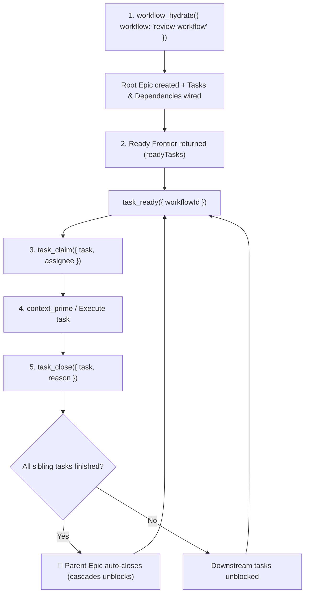
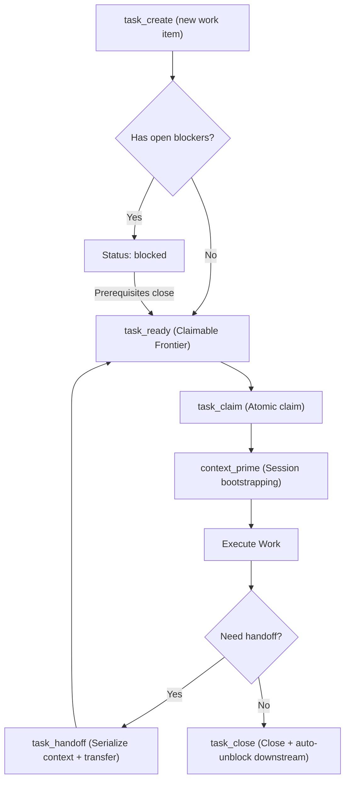

# Workflow MCP Server - Instructions & Best Practices

The **workflow-mcp** server provides tools to design, validate, execute, step through, and visualize
structured workflows, Directed Acyclic Graphs (DAGs), review-fix loops, and subworkflows.

---

## 1. Core Concepts: Templates vs. Hydrated Epics & Tasks

- **Workflow Definition (Template / DAG)**:
  - Created and modified using `workflow_create`, `node_add`, `node_connect`, `node_edit`,
    `node_delete`, `workflow_patch`, `workflow_validate`, `workflow_visualize`.
  - Defines the graph topology: nodes (`start`, `step`, `decision`, `user_interaction`,
    `subworkflow`, `end`) and directional edges.
- **Workflow Hydration (Actionable Epic & Task DAG)**:
  - Created by invoking `workflow_hydrate({ workflow: "review-workflow" })`.
  - Transforms the workflow template into a root **Epic** (`type: "epic"`).
  - Nested subworkflows hydrate into nested child Epics ("an epic in an epic").
  - Nodes become actionable tasks; edges become directional blocking dependencies.
  - Nodes can configure `pipelineTemplateId` in their `config` (e.g.
    `node.config.pipelineTemplateId`), which pre-attaches the multi-stage pipeline and resolves the
    initial stage role upon hydration.
  - Workflows serve to hydrate tasks and dependencies into an Epic. Stepping through workflow nodes
    is retired in favor of native task management (`task_ready`, `task_claim`, `task_close`).

---

## 2. Name, Slug, & Hierarchical Path Resolution

All tools support flexible entity identifiers so you never have to manually lookup UUIDs:

- **UUID**: `7d1cd599-d9fd-44ee-88c1-9389db3eb076`
- **Workflow Name or Slug**: `"Review Workflow"`, `"review-workflow"`, `"security-check"`
- **Hierarchical Subworkflow Paths**: `"review-workflow/security"` resolves the `security` child
  workflow under `review-workflow`
- **Node Names & Slugs**: `"Step 5-web"`, `"step-5-web"`, `"Risk Gate"`
- **Parameter Aliases**: Tools accept either `workflow` / `workflowId`, `node` / `nodeId`,
  `fromNode` / `fromNodeId`, `toNode` / `toNodeId`, `nodes` / `nodeIds`.

---

## 3. Hydration & Task-Driven Execution Lifecycle

Follow this standard loop when executing a workflow:



### Step 1: Hydrate Workflow into Epic (`workflow_hydrate`)

- **Call**: `workflow_hydrate({ workflow: "review-workflow" })`
- **What it returns**:
  - `epic`: The root Epic created for this workflow run.
  - `epics`: Array of all created Epics (root + nested subworkflow Epics).
  - `tasks`: All actionable tasks created from nodes.
  - `dependencies`: All dependency edges wired between tasks.
  - `readyTasks`: Immediate ready frontier of tasks with zero open blockers.
  - `suggestedNextTools`: Direct tool invocations for the LLM to claim and start work.

### Step 2: Discover Available Work (`task_ready`)

- **Call**: `task_ready({ workflowId: "<workflow_id>", role?: "<role>" })`
- **What it returns**:
  - Array of claimable tasks that have zero unresolved blockers.

### Step 3: Claim and Execute (`task_claim`)

- **Call**: `task_claim({ task: "<task_id>", assignee: "<agent_id>" })`
- Atomically locks the task to the current agent, preventing duplicate work.

### Step 4: Complete Work (`task_close`)

- **Call**: `task_close({ task: "<task_id>", reason: "Verified implementation" })`
- Automatically evaluates dependent tasks and unblocks any downstream tasks whose prerequisites are
  all satisfied.
- Automatically auto-closes parent Epics when all child tasks are completed!

### Step 5: Inspecting Hierarchy (`workflow_tree`)

- **Call**: `workflow_tree({ workflow: "review-workflow", depth: 3 })`
- Instantly returns a recursive hierarchical tree diagram of parent workflows and all nested child
  subworkflows.

### Step 6: Cross-Workflow Search (`workflow_search`)

- **Call**: `workflow_search({ query: "authentication OR passkey", includeDescriptions: true })`
- Instantly searches across standalone workflows and child subworkflows with line context snippets.

### Step 7: Batch Node Updates (`workflow_patch`)

- **Call**:
  ```typescript
  workflow_patch({
    workflow: "review-workflow/security",
    nodes: [
      { node: "Step 5-web", description: "Updated web security scan prompt" },
      { node: "Risk Gate", config: { options: ["allow", "block"] } },
    ],
  });
  ```
- Applies multi-node edits atomically in a single roundtrip.

---

## 4. Work Tracking & Task Lifecycle (Beads Primitives)

`workflow-mcp` includes native task tracking and work scheduling inspired by the Beads framework:



- **Task Creation**:
  `task_create({ title: "Fix edge case", workflowId, executionId, nodeId, role: "security" })`
- **Ready Frontier**: `task_ready({ role: "security" })` returns only tasks with zero open blockers.
- **Atomic Claiming**: `task_claim({ task: "tk-a1b2c3", assignee: "agent-1" })` locks the task.
- **Dependencies**:
  `task_depend({ action: "add", fromTask: "tk-prereq", toTask: "tk-dependent", type: "blocks" })`
- **Closing & Cascading**: `task_close({ task: "tk-a1b2c3", reason: "Verified tests" })`
  automatically unblocks downstream tasks.

---

## 5. Roles & Single-Entry Role Journals

- **User-Defined Roles**: Roles are arbitrary strings (`"frontend"`, `"security-reviewer"`,
  `"human"`). Created automatically or via `role_create`.
- **Role Journals**: A single-entry snapshot per role (`journal_write` / `journal_read`).
  - Before a role shuts down, the agent writes what it was doing and next steps via `journal_write`.
  - When reawoken, the agent reads `journal_read` (or runs `context_prime`) to resume with full
    state awareness.
  - Only the **last entry** is kept per user/role, ensuring clean, fresh wakeup context.

---

## 6. Scoped Memory & Access Logging

Memories persist institutional knowledge across runs, agent crashes, and sessions:

- **Scopes**:
  - `workflow`: Scoped to a workflow template (e.g. API standards, architectural constraints).
  - `node`: Scoped to a specific node (e.g. known edge cases, test inputs).
  - `role`: Scoped to a role (e.g. security checklist, design system rules). Follows the role
    everywhere.
- **Listing Summaries**: `memory_list` returns one-line summaries only—never leaking full content
  into context windows prematurely. Includes `lastAccessed` timestamp and `accessCount`.
- **Logged Recall**: `memory_recall` returns full content and logs a `MemoryAccessRecord` to track
  memory usage patterns and identify stale knowledge.
- **Cleanup**: `memory_delete` returns the memory's lifetime `accessCount` before deletion.

---

## 7. Work Handoffs & Context Priming

- **`task_handoff`**: Transfers a task to another agent or role queue. Appends working context,
  records `rejectedApproaches` so subsequent agents don't repeat failures, and updates task
  assignment.
- **`context_prime`**: The primary session bootstrapping command. Gathers:
  1. Role journal (last shutdown entry)
  2. Workflow memories
  3. Node memories
  4. Role memories
  5. Active task details & context
  6. Recent handoff history & rejected approaches
  7. Ready frontier tasks Compacts all information into a token budget (default 2,000 tokens) and
     logs memory access records.

---

## 8. Tool Quick Reference (44 Tools)

| Category                       | Tool Name                      | Description                                                   | Key Arguments                                                                                                                                                                                  |
| :----------------------------- | :----------------------------- | :------------------------------------------------------------ | :--------------------------------------------------------------------------------------------------------------------------------------------------------------------------------------------- |
| **Hydration & Tasks**          | `workflow_hydrate`             | Hydrate workflow DAG into actionable Epic & Task DAG.         | `workflow`, `title?`, `description?`, `parentTaskId?`, `role?`, `priority?`                                                                                                                    |
| **Authoring**                  | `workflow_create`              | Create a new workflow template.                               | `name`, `description?`, `intendedForIndependentRun?`                                                                                                                                           |
| **Authoring**                  | `workflow_list`                | List existing workflows.                                      | `filter?`, `format?`                                                                                                                                                                           |
| **Authoring**                  | `workflow_get`                 | Inspect workflow graph (nodes & edges).                       | `workflow`, `includeSubworkflows?`, `format?`                                                                                                                                                  |
| **Authoring**                  | `workflow_search`              | Cross-workflow search across names, prompts & configs         | `query`, `workflow?`, `type?`, `includeDescriptions?`                                                                                                                                          |
| **Authoring**                  | `workflow_patch`               | Batch edit multiple nodes in one atomic transaction.          | `workflow`, `nodes: [{ node, name?, description?, config? }]`                                                                                                                                  |
| **Authoring**                  | `workflow_tree`                | Recursive hierarchical view of nested subworkflows.           | `workflow`, `depth?`, `format?`                                                                                                                                                                |
| **Authoring**                  | `workflow_delete`              | Delete a workflow and all its nodes/edges.                    | `workflow`                                                                                                                                                                                     |
| **Nodes**                      | `node_add`                     | Add a node to a workflow.                                     | `workflow`, `name`, `type`, `description?`, `config?`                                                                                                                                          |
| **Nodes**                      | `node_edit`                    | Modify an existing node.                                      | `workflow`, `node`, `name?`, `description?`, `config?`                                                                                                                                         |
| **Nodes**                      | `node_delete`                  | Delete a node and connected edges.                            | `workflow`, `node`                                                                                                                                                                             |
| **Nodes**                      | `node_get`                     | Retrieve detailed node info.                                  | `workflow`, `node`, `format?`                                                                                                                                                                  |
| **Nodes**                      | `node_list`                    | List all nodes in a workflow.                                 | `workflow`                                                                                                                                                                                     |
| **Edges**                      | `node_connect`                 | Connect two nodes with optional condition.                    | `workflow`, `fromNode`, `toNode`, `condition?`                                                                                                                                                 |
| **Edges**                      | `node_disconnect`              | Remove edge between two nodes.                                | `workflow`, `fromNode`, `toNode`                                                                                                                                                               |
| **Validation & Viz**           | `workflow_validate`            | Validate DAG, start/end nodes, cycles, heuristics.            | `workflow`                                                                                                                                                                                     |
| **Validation & Viz**           | `workflow_visualize`           | Generate SSR visualizer link, Mermaid chart, or HTML.         | `workflow`, `executionId?`, `format?`, `expiresInDays?`, `filePath?`                                                                                                                           |
| **Subworkflows & Portability** | `workflow_extract_subworkflow` | Extract node sequence into a child subworkflow.               | `workflow`, `nodes`, `subworkflowName`                                                                                                                                                         |
| **Subworkflows & Portability** | `workflow_export`              | Export workflow bundle JSON.                                  | `workflow`, `includeSubworkflows?`, `filePath?`                                                                                                                                                |
| **Subworkflows & Portability** | `workflow_import`              | Import workflow bundle JSON.                                  | `bundleData?`, `filePath?`, `overwrite?`, `clone?`                                                                                                                                             |
| **Tasks**                      | `task_create`                  | Create an assignable work unit or epic.                       | `title`, `type?`, `description?`, `role?`, `workflow?`, `node?`, `parentTaskId?`, `pipelineTemplateId?`                                                                                        |
| **Tasks**                      | `task_create_batch`            | Batch create multiple tasks and wire dependencies.            | `tasks: [{ title, tempId?, role?, priority?, type?, parentTaskId?, pipelineTemplateId?, inputs?, metadata? }]`, `dependencies?`, `workflow?`, `executionId?`, `pipelineTemplateId?`, `format?` |
| **Tasks**                      | `task_list`                    | List tasks with status filter and summary counts.             | `workflow?`, `executionId?`, `status?`, `role?`, `assignee?`, `type?`                                                                                                                          |
| **Tasks**                      | `task_get`                     | Get task details, dependencies, and child subtasks.           | `task`, `includeDependencies?`, `includeChildren?`                                                                                                                                             |
| **Tasks**                      | `task_update`                  | Modify task metadata and append to context notes.             | `task`, `title?`, `description?`, `status?`, `priority?`, `context?`                                                                                                                           |
| **Tasks**                      | `task_close`                   | Close task and automatically unblock downstream tasks.        | `task`, `reason?`                                                                                                                                                                              |
| **Tasks**                      | `task_ready`                   | Compute claimable frontier (zero open blockers).              | `workflow?`, `role?`, `includeEpics?`, `limit?`                                                                                                                                                |
| **Tasks**                      | `task_claim`                   | Atomically lock a task to an assignee.                        | `task`, `assignee`                                                                                                                                                                             |
| **Tasks**                      | `task_depend`                  | Add or remove dependency edges between tasks.                 | `action`, `fromTask`, `toTask`, `type?`                                                                                                                                                        |
| **Tasks**                      | `task_comment`                 | Append a lightweight log comment (max 256 chars).             | `task`, `content`, `author?`                                                                                                                                                                   |
| **Pipelines**                  | `pipeline_template_create`     | Create a reusable multi-stage flow template.                  | `id`, `name`, `stages`, `description?`, `rejectionLoopPolicy?`, `maxRejectionCycles?`                                                                                                          |
| **Pipelines**                  | `pipeline_template_list`       | List all registered flow templates.                           | `format?`                                                                                                                                                                                      |
| **Pipelines**                  | `pipeline_template_get`        | Retrieve pipeline template definition.                        | `templateId`, `format?`                                                                                                                                                                        |
| **Pipelines**                  | `task_pipeline_attach`         | Attach a pipeline template to an existing task.               | `task`, `templateId`, `strictMode?`                                                                                                                                                            |
| **Pipelines**                  | `task_pipeline_override`       | Manually override stage transition on a task pipeline.        | `task`, `targetStageId`, `reason`                                                                                                                                                              |
| **Pipelines**                  | `task_pipeline_status`         | Inspect current pipeline stage and allowed transitions.       | `task`, `format?`                                                                                                                                                                              |
| **Roles**                      | `role_create`                  | Define a user-defined role.                                   | `name`, `description?`                                                                                                                                                                         |
| **Roles**                      | `role_list`                    | List registered user-defined roles.                           | `format?`                                                                                                                                                                                      |
| **Journal**                    | `journal_write`                | Save single-entry role shutdown snapshot.                     | `role`, `entry`, `writtenBy?`                                                                                                                                                                  |
| **Journal**                    | `journal_read`                 | Read role's latest journal entry on wakeup.                   | `role`                                                                                                                                                                                         |
| **Memory**                     | `memory_save`                  | Save persistent memory (workflow, node, or role scope).       | `key`, `summary`, `content`, `scope`, `workflow?`, `node?`, `role?`                                                                                                                            |
| **Memory**                     | `memory_list`                  | List memory summaries with lastAccessed & accessCount.        | `workflow?`, `node?`, `role?`, `tags?`, `format?`                                                                                                                                              |
| **Memory**                     | `memory_recall`                | Retrieve full content and log access record.                  | `key`, `scope?`, `workflow?`, `node?`, `role?`, `accessedBy?`                                                                                                                                  |
| **Memory**                     | `memory_delete`                | Delete memory and return lifetime accessCount.                | `key`, `scope?`, `workflow?`, `node?`, `role?`                                                                                                                                                 |
| **Memory**                     | `memory_search`                | Full-text search across memories with BM25 vector ranking.    | `query`, `scope?`, `workflow?`, `role?`, `tags?`, `limit?`                                                                                                                                     |
| **Handoff**                    | `task_handoff`                 | Transfer work preserving context and rejected approaches.     | `task`, `reason`, `contextSummary?`, `rejectedApproaches?`, `toRole?`                                                                                                                          |
| **Context**                    | `context_prime`                | Bootstrap agent session with journal, memories, and frontier. | `workflow?`, `executionId?`, `taskId?`, `role?`, `tokenBudget?`                                                                                                                                |
